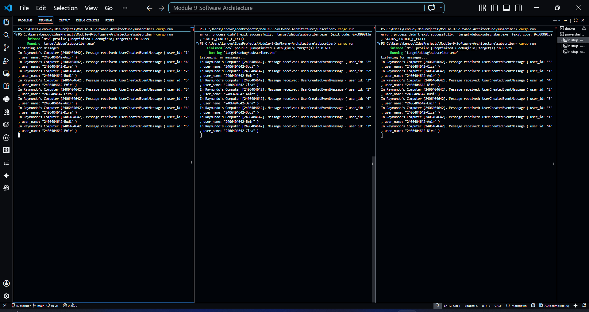
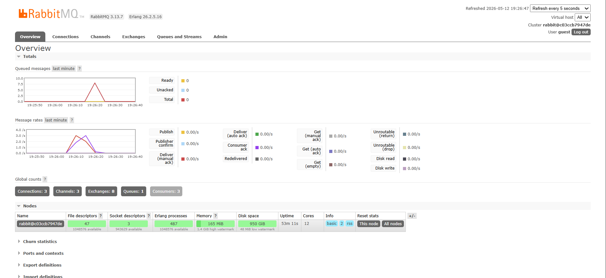

1. What is amqp?

    AMQP stands for Advanced Message Queuing Protocol. It is an open standard protocol for message-oriented middleware that enables applications to communicate with each other by sending and receiving messages. AMQP provides a way to ensure reliable and secure communication between different systems, regardless of their underlying technology.

2. What does it mean? guest:guest@localhost:5672 , what is the first guest, and what is the second guest, and what is localhost:5672 is for?

    In the context of the connection string "guest:guest@localhost:5672", the first "guest" refers to the username, and the second "guest" refers to the password. "localhost:5672" indicates that the RabbitMQ server is running on the local machine (localhost) and is listening for connections on port 5672, which is the default port for AMQP communication.

Screenshot: 

I ran "cargo run" at the publisher for 5 times quickly. And, in the screenshot above, the total number of queued messages is 15, which means that the subscriber program has received but has not yet processed 15 messages from the publisher. The subscriber is simulating a slow processing time by sleeping for 1000 milliseconds (1 second) before acknowledging each message. This results in a backlog of messages in the queue, as the subscriber is not able to keep up with the rate at which messages are being published.

I started three instances of the subscriber program simultaneously. And then, I, for the second time, ran "cargo run" for 5 times quickly at the publisher. Each subscriber instance is consuming messages from the same RabbitMQ server. The first screenshot shows three command prompts running the subscriber program, while the second screenshot shows the RabbitMQ management interface with three consumers connected to the same queue. The total number of queued messages are halved to 7.5 from the original 15. This is because this subscriber setup allows for load balancing, as the messages will be distributed among the three subscribers, helping to reduce the backlog of messages in the queue and improve processing efficiency.